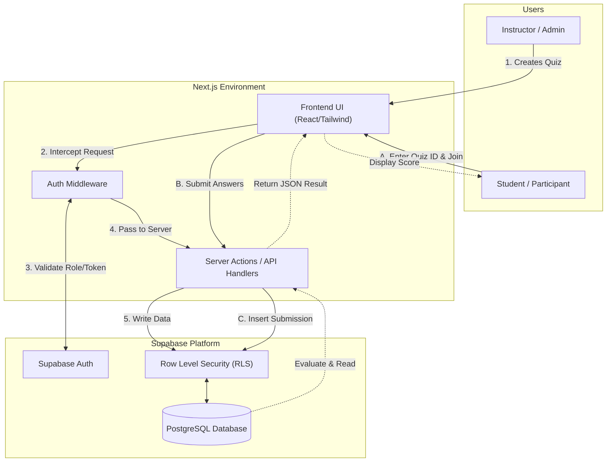

# QuizRoom

QuizRoom is a modern, interactive learning and assessment platform built with Next.js and Supabase. It allows educators and instructors to create, manage, and distribute custom quizzes seamlessly, while providing students with an intuitive interface to participate and view their immediate results.

---

## 🌟 Data Flow Architecture (DFA)

The data flow architecture below illustrates the secure interaction between the different user roles, the Next.js application layer, and the Supabase backend.



---

## 🔄 Detailed Workflow

### 👨‍🏫 Instructor (Admin) Workflow
1. **Onboarding & Authentication:**
   - The instructor navigates to `/admin/signup` or `/admin/login`.
   - Supabase Auth logs the instructor in and creates a secure session.
   - The instructor is redirected to their centralized Dashboard.

2. **Quiz Formulation:**
   - On the Dashboard, the instructor clicks **Create Quiz**.
   - The instructor configures quiz settings:
     - **Metadata:** Title and short description.
     - **Rules:** Time limit per quiz.
     - **Content:** Adds multiple-choice questions, specifying the correct option for each.
   - The form payload is validated via **Zod** schema.
   - The quiz is saved securely into the Supabase PostgreSQL database.

3. **Distribution & Management:**
   - Once successfully generated, the app produces a unique **Quiz ID**.
   - The instructor broadcasts this ID (or joining link) to the participants.
   - Instructors can access active/past quizzes through their dashboard to monitor real-time completion rates and scores. 

---

### 🎓 Student Workflow
1. **Accessing the Assessment:**
   - The student navigates to the landing page and selects **Join a Quiz** (`/join`).
   - The student inputs the unique **Quiz ID** provided by the instructor.
   - *Optional:* Students can also authenticate via `/student/login` if they wish to have their scores attached to a persistent profile.

2. **Taking the Quiz:**
   - Upon entering the correct ID, the next.js router redirects to the active quiz interface.
   - Client-side React state begins tracking the time limit.
   - The student iterates through the questions, interacting with customized Radix UI components.

3. **Submission & Evaluation:**
   - The student reviews their answers and hits **Submit**.
   - If the timer hits zero, the quiz forcefully auto-submits the current snapshot of answers.
   - A Server Action is triggered, parsing the input answers and securely cross-referencing them against the protected correct answers residing inside the Database (shielded by Row Level Security).

4. **Result Dissemination:**
   - The final score is computed on the backend.
   - A detailed breakdown (score, correct answers, missed questions) is transmitted back to the client.
   - The student views their performance summary immediately on the completion page.

---

## 🛠️ Technology Stack
- **Framework:** Next.js (App Router)
- **Language:** TypeScript
- **Styling:** Tailwind CSS
- **Components:** Radix UI Primitives, `shadcn/ui` ecosystem
- **Backend & Database:** Supabase (PostgreSQL)
- **Authentication:** `@supabase/ssr` (Server-Side Rendering Auth Integration)
- **Form Handling:** React Hook Form & Zod Validation

---

## 🚀 Getting Started (Run Locally)

Follow these steps to set up and run the QuizRoom application on your local machine.

### Prerequisites
- [Node.js](https://nodejs.org/en) (v18 or above recommended)
- [pnpm](https://pnpm.io/) package manager
- A [Supabase](https://supabase.com/) account and project for database and authentication.

### 1. Clone & Install Dependencies
Navigate to the project directory and install the required dependencies. The project relies on \`pnpm\`:

```bash
# If cloned from a repository:
# git clone <repository-url>
# cd <repository-directory>

# Install dependencies:
pnpm install
```

### 2. Configure Environment Variables
Create a \`.env.local\` file in the root directory of the project. You must supply your Supabase configuration keys:

```env
NEXT_PUBLIC_SUPABASE_URL=your_supabase_project_url
NEXT_PUBLIC_SUPABASE_ANON_KEY=your_supabase_anon_key
```

> **Note:** You can retrieve these values from your Supabase Dashboard under **Project Settings > API**. Ensure you set up Authentication and a Database in Supabase prior to running the app.

### 3. Run the Development Server
Fire up the Next.js development server:

```bash
pnpm run dev
```

Open [http://localhost:3000](http://localhost:3000) in your web browser to interact with the application.
